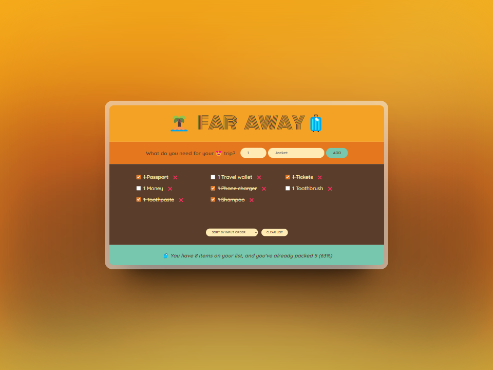

# Far Away

This is a React project developed using [Create React App](https://github.com/facebook/create-react-app) as part of '[The Ultimate React Course 2024](https://www.udemy.com/course/the-ultimate-react-course/)' by Jonas Schmedtmann.

## What I learned

In this initial project, I build a travel list page to grasp the fundamentals of React, covering topics such as:

- Building a Form and Handling Submissions
- Understanding Controlled Elements
- Differentiating Between State and Props
- Implementing State Management with React
- Lifting State Up in React
- Managing State Changes in React
- Implementing Child-to-Parent Communication
- Performing Complex Immutable Data Operations
- Understanding Derived State in React
- Sorting Items in React
- Organizing Components into Separate Files

### Screenshot

Here's a glimpse of the final project:



## Installation

To install the project, follow these steps:

1. Clone the repository:

```bash
git clone https://github.com/xyzeez/far-away.git
```

2. Navigate to the project directory:

```bash
cd far-away
```

3. Install dependencies:

```bash
npm install
```

4. Start the application:

```bash
npm start
```
